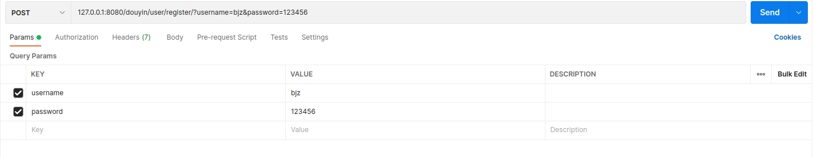
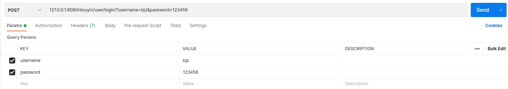

# user service

## version 1 
- register and auto login
- login

### start
#### 1. Setup Basic Dependence
```shell
sudo docker compose up
```

#### 2.Run User RPC Server
```shell
cd cmd/user
sh build.sh
sh output/bootstrap.sh
```

#### 3.Run API Server
```shell
cd cmd/api
chmod +x run.sh
sh run.sh
```

### API test
postman desktop
#### 1.register



#### 2.login


## 20220525-现在的问题是:

- 1.关注/取关的时候,相应用户的粉丝数量不会动

- 2.关注列表,微服务的server显示成功response,但数据在送往前端的路上报了内存地址错误,怀疑指针数组传来传去写错了

## 20220526

- 基本实现所有API,postman上测试过

- 问题1: 关注/取关仍然可以重复操作

不知道前端能不能重复点关注和取关按钮,不过就算前端有保护,后端也应该拒绝重复操作...待改进

- 问题2:app还没测试通过

目前可能是返回格式还有问题,所以app没有正确显示.但后端能正常响应并返回数据的...待改进

